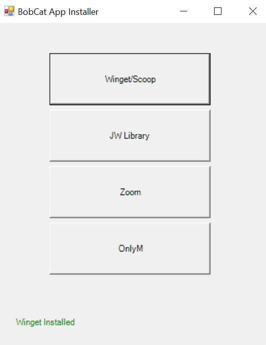

# JW-App-Installer
This is a powershell script to let you download JW Library and zoom and onlyM without using the MS Store App

To Run the app
open a command prompt
you can press the Win + R
go to the direct you put the file at
type in or copy and paste this
Powershell.exe -ExecutionPolicy Bypass -File JW-Install.ps1
If you see that winget is not installed please click on winget/scoopp to install that first :)

